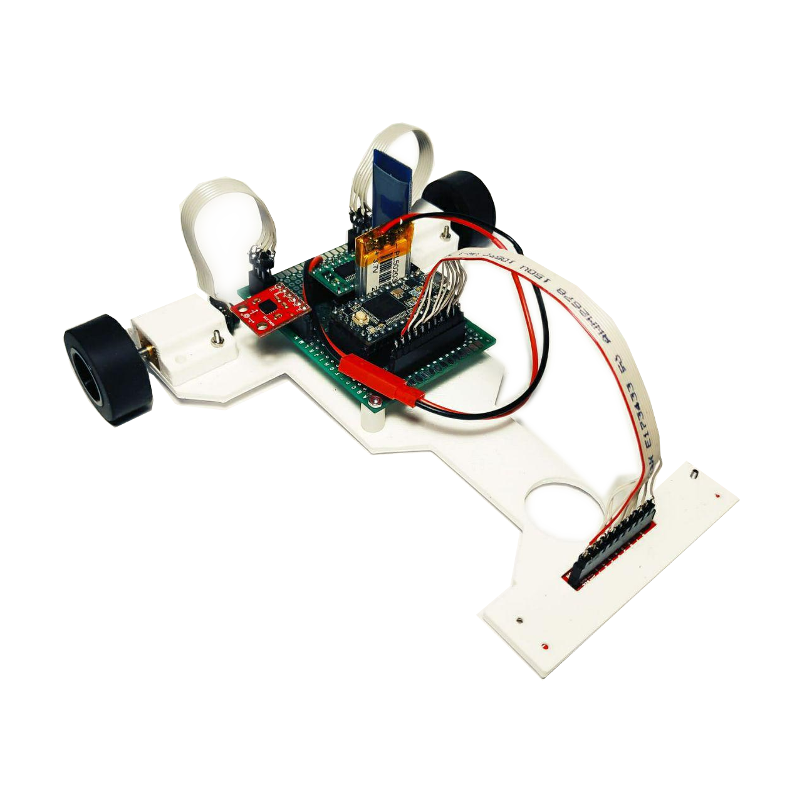
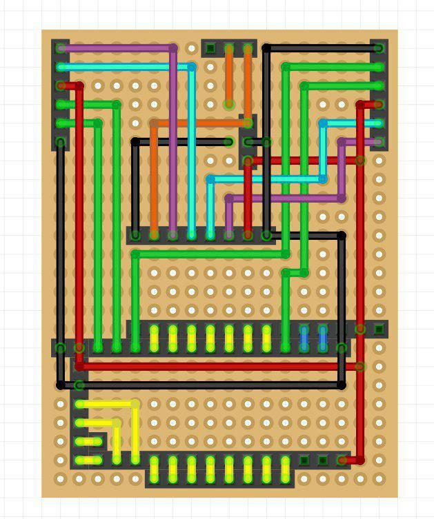
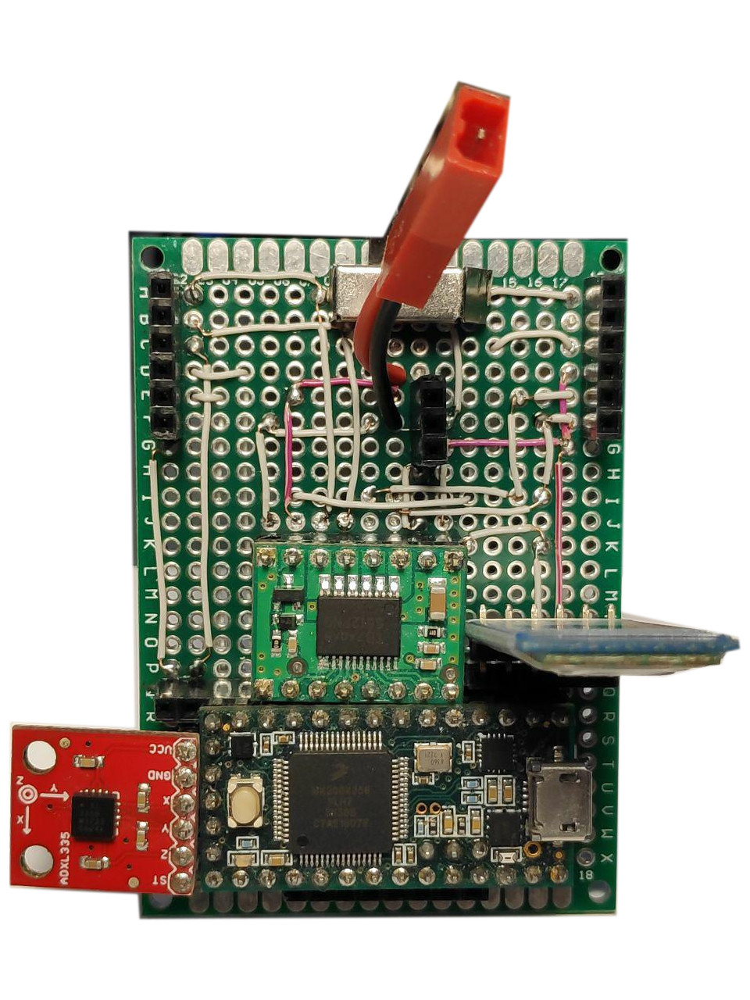
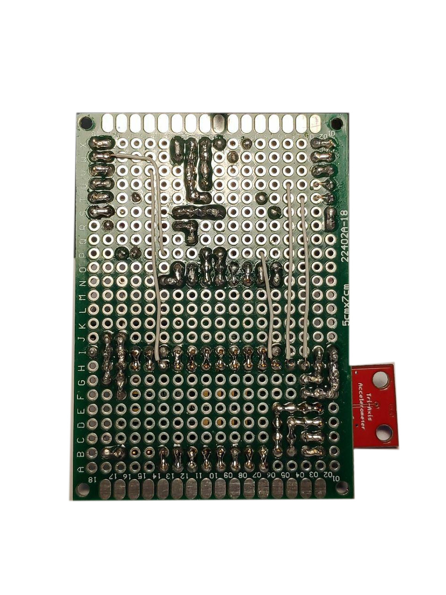
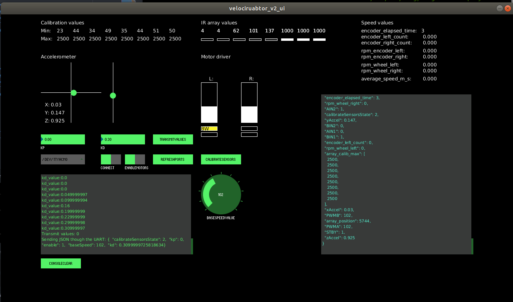

# VelocirUABtor v2

Competition line follower developed with the [UAB](https://www.uab.cat/web/universitat-autonoma-de-barcelona-1345467954774.html) Physical Computing Communitiy sponsorhip.

## Built With

In order to work in the project we recommend to use:
* [Atom](https://atom.io) - IDE.
* [PlatformIO](https://platformio.org/install/ide?install=atom) - Framework used to work with Teensy 3.2 that can be integrated in Atom.
* [GitKraken](https://www.gitkraken.com/) - Multiplatform Git client.
* [Procesing](https://processing.org/) - Language used to develop the user interface.
* [Fritzing](https://fritzing.org/home/) - Tool used to design the hardware connections.

## Main Components

* [ADXL335](https://www.sparkfun.com/products/9269) - Accelerometer.
* [HC-05](https://components101.com/wireless/hc-05-bluetooth-module) - Bluetooth Module.
* [Pololu Magnetic Encoders](https://www.pololu.com/product/2598) - Encoders for micrometal motors.
* [TB6612FNG](https://www.pololu.com/product/713) - Motor Driver.
* [Reflectance Sensor Array](https://www.pololu.com/product/713) - Array of 8 IR sensors used to detect the track.
* [Teensy 3.2](https://www.pjrc.com/store/teensy32.html) -  32 bit ARM processor.

## User Interface
The microcontroller builds JSON frames with the sensors values that are transmitted to the laptop using the HC-05 module. 

## Authors

* **Steven Macías** - *Initial work* - [StevenMacias](https://github.com/StevenMacias)

## Contributors

* **Victor Escobedo** - *User interface features.* - [victorEscobedo](https://github.com/victorEscobedo)

## Acknowledgments

* **Fernando Vilariño** - *Mentor* - [Linkedin: fernandovilarino](https://www.linkedin.com/in/fernandovilarino/)
